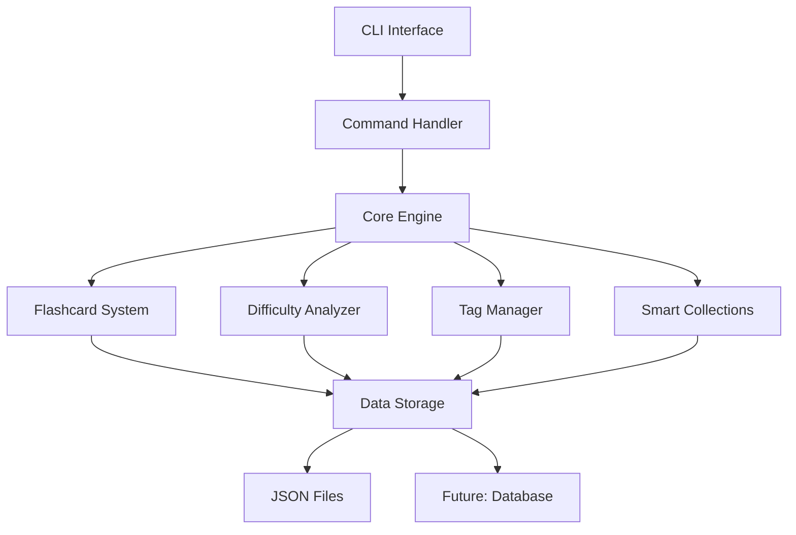

# 🔧 Developer Guide

Welcome to the FlashGenie Developer Guide! This comprehensive resource is designed for contributors, plugin developers, and anyone interested in extending or integrating with FlashGenie.

## 🎯 **Developer Guide Overview**

This guide covers everything you need to know about FlashGenie's architecture, APIs, and development practices:

### 📚 [API Reference](api-reference.md)
Complete technical documentation of FlashGenie's classes, methods, and interfaces.

**What you'll find:**
- Core class documentation
- Method signatures and parameters
- Usage examples and code snippets
- Integration patterns

### 🔌 [Plugin Development](plugin-development.md)
Learn how to extend FlashGenie with custom plugins and integrations.

**What you'll learn:**
- Plugin architecture overview
- Creating custom algorithms
- Building importers and exporters
- Publishing and distributing plugins

### 🏗️ [Architecture](architecture.md)
Deep dive into FlashGenie's system design and architectural decisions.

**What you'll understand:**
- System architecture overview
- Data flow and processing
- Design patterns and principles
- Performance considerations

### 🤝 [Contributing](contributing.md)
Everything you need to know about contributing to FlashGenie.

**What you'll learn:**
- Development environment setup
- Coding standards and guidelines
- Pull request process
- Community guidelines

### 🧪 [Testing](testing.md)
Comprehensive testing strategies and frameworks used in FlashGenie.

**What you'll master:**
- Testing philosophy and approach
- Unit testing with pytest
- Integration testing strategies
- Performance testing

## 🚀 **Quick Start for Developers**

### Development Environment Setup

=== "🐍 Python Environment"

    ```bash
    # Clone the repository
    git clone https://github.com/himent12/FlashGenie.git
    cd FlashGenie
    
    # Create virtual environment
    python -m venv venv
    source venv/bin/activate  # On Windows: venv\Scripts\activate
    
    # Install dependencies
    pip install -r requirements.txt
    pip install -r dev-requirements.txt
    ```

=== "🔧 Development Tools"

    ```bash
    # Install development tools
    pip install black flake8 mypy pytest pytest-cov
    
    # Set up pre-commit hooks
    pip install pre-commit
    pre-commit install
    
    # Verify setup
    python -m pytest tests/
    ```

=== "📚 Documentation Setup"

    ```bash
    # Install documentation dependencies
    pip install -r docs-requirements.txt
    
    # Serve documentation locally
    mkdocs serve
    
    # Build documentation
    mkdocs build
    ```

### Your First Contribution

Follow this checklist for your first contribution:

- [ ] **Fork the repository** on GitHub
- [ ] **Set up development environment** locally
- [ ] **Find a good first issue** labeled `good-first-issue`
- [ ] **Create a feature branch** from `main`
- [ ] **Make your changes** following coding standards
- [ ] **Write tests** for your changes
- [ ] **Update documentation** if needed
- [ ] **Submit a pull request** with clear description

## 🏗️ **Architecture Overview**

FlashGenie follows a modular, extensible architecture:



### Core Components

=== "🧠 Core Engine"

    **Purpose**: Central coordination and business logic
    
    **Key Classes**:
    - `QuizEngine`: Manages quiz sessions and logic
    - `DifficultyAnalyzer`: Handles smart difficulty adjustment
    - `PerformanceTracker`: Tracks learning metrics
    
    **Responsibilities**:
    - Coordinate between components
    - Manage quiz sessions
    - Apply learning algorithms

=== "📚 Data Layer"

    **Purpose**: Data persistence and management
    
    **Key Classes**:
    - `DataStorage`: Abstract storage interface
    - `JSONStorage`: JSON file implementation
    - `Flashcard`: Individual flashcard model
    - `Deck`: Collection of flashcards
    
    **Responsibilities**:
    - Data persistence
    - CRUD operations
    - Data validation

=== "🏷️ Organization Layer"

    **Purpose**: Content organization and categorization
    
    **Key Classes**:
    - `TagManager`: Hierarchical tagging system
    - `SmartCollectionManager`: Dynamic collections
    - `AutoTagger`: Content analysis and tagging
    
    **Responsibilities**:
    - Tag management
    - Content categorization
    - Smart grouping

=== "💻 Interface Layer"

    **Purpose**: User interaction and command processing
    
    **Key Classes**:
    - `CommandHandler`: CLI command processing
    - `TerminalUI`: User interface components
    - `QuizInterface`: Interactive quiz experience
    
    **Responsibilities**:
    - Command parsing
    - User interaction
    - Output formatting

## 🔌 **Extension Points**

FlashGenie is designed for extensibility:

### Custom Algorithms

Implement your own learning algorithms:

```python
from flashgenie.core.difficulty_analyzer import DifficultyAnalyzer

class MyCustomAnalyzer(DifficultyAnalyzer):
    def analyze_performance(self, card, responses):
        # Your custom analysis logic
        return performance_metrics
    
    def suggest_difficulty_adjustment(self, performance):
        # Your custom adjustment logic
        return difficulty_change
```

### Custom Importers

Add support for new file formats:

```python
from flashgenie.data.importers.base import BaseImporter

class MyFormatImporter(BaseImporter):
    def can_import(self, file_path):
        return file_path.endswith('.myformat')
    
    def import_flashcards(self, file_path):
        # Your import logic
        return flashcards
```

### Custom Collections

Create new smart collection types:

```python
from flashgenie.core.smart_collections import BaseCollection

class MyCustomCollection(BaseCollection):
    def get_criteria(self):
        return "Custom criteria description"
    
    def filter_cards(self, cards):
        # Your filtering logic
        return filtered_cards
```

## 📊 **Development Metrics**

Track your development progress:

| Metric | Current | Target |
|--------|---------|--------|
| Test Coverage | 85% | 90% |
| Code Quality | A | A+ |
| Documentation Coverage | 80% | 95% |
| Performance Score | Good | Excellent |

### Code Quality Standards

- **Type Hints**: All public methods must have type hints
- **Docstrings**: All classes and public methods need docstrings
- **Testing**: Minimum 80% test coverage for new code
- **Linting**: Code must pass flake8 and black formatting
- **Performance**: No regressions in benchmark tests

## 🎯 **Development Roadmap**

### Current Sprint (v1.5)
- [ ] Enhanced documentation system
- [ ] Plugin architecture foundation
- [ ] Performance optimizations
- [ ] Extended API coverage

### Next Sprint (v1.6)
- [ ] GUI framework integration
- [ ] Advanced analytics engine
- [ ] Machine learning features
- [ ] Cloud synchronization

### Future Releases
- [ ] Mobile app development
- [ ] Collaborative features
- [ ] Advanced AI integration
- [ ] Enterprise features

## 🤝 **Community and Support**

### Getting Help

- **GitHub Discussions**: General questions and ideas
- **GitHub Issues**: Bug reports and feature requests
- **Developer Chat**: Real-time discussion (Discord/Slack)
- **Email**: Direct contact for sensitive issues

### Contributing Guidelines

1. **Code of Conduct**: Be respectful and inclusive
2. **Issue First**: Discuss major changes before implementing
3. **Small PRs**: Keep pull requests focused and small
4. **Tests Required**: All changes need appropriate tests
5. **Documentation**: Update docs for user-facing changes

### Recognition

We recognize contributors through:

- **Contributor List**: Recognition in README and docs
- **Release Notes**: Highlighting significant contributions
- **Badges**: GitHub profile badges for contributors
- **Swag**: FlashGenie merchandise for regular contributors

## 📚 **Learning Resources**

### Recommended Reading

- **Clean Code** by Robert Martin - Code quality principles
- **Design Patterns** by Gang of Four - Software design patterns
- **Effective Python** by Brett Slatkin - Python best practices
- **Building Microservices** by Sam Newman - Architecture patterns

### Online Courses

- **Python Architecture Patterns** - Advanced Python design
- **Test-Driven Development** - TDD methodology
- **API Design** - RESTful API best practices
- **Performance Optimization** - Python performance tuning

### FlashGenie-Specific Resources

- **Architecture Decision Records**: Design decision documentation
- **Code Review Guidelines**: Standards for code reviews
- **Performance Benchmarks**: Performance testing results
- **Security Guidelines**: Security best practices

## 🎉 **Ready to Contribute?**

Choose your path based on your interests and experience:

<div class="grid cards" markdown>

-   :material-code-braces: **First-Time Contributor**

    ---

    Start with good first issues and learn our workflow

    [:octicons-arrow-right-24: Contributing Guide](contributing.md)

-   :material-api: **API Developer**

    ---

    Explore our APIs and build integrations

    [:octicons-arrow-right-24: API Reference](api-reference.md)

-   :material-puzzle: **Plugin Developer**

    ---

    Extend FlashGenie with custom functionality

    [:octicons-arrow-right-24: Plugin Development](plugin-development.md)

-   :material-architecture: **Architecture Enthusiast**

    ---

    Understand our system design and contribute to architecture

    [:octicons-arrow-right-24: Architecture Guide](architecture.md)

</div>

---

**Let's build the future of intelligent learning together!** 🧞‍♂️✨
