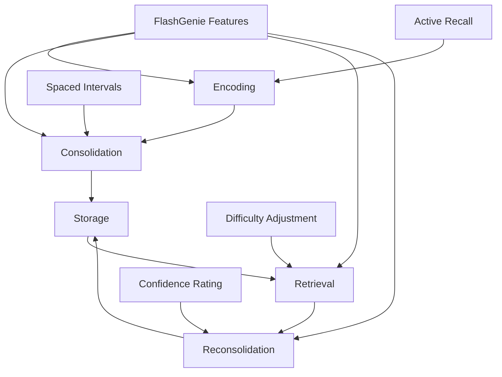

# 🧪 Learning Science

Understanding the research and cognitive science principles that make FlashGenie an effective learning tool. This guide explores the scientific foundation behind FlashGenie's intelligent features.

## 🎯 **Scientific Foundation**

FlashGenie is built on decades of cognitive science research and learning theory. Our algorithms implement proven principles that optimize memory formation, retention, and recall.

### 📚 **Core Research Areas**

=== "🧠 Memory & Cognition"

    **Ebbinghaus Forgetting Curve** (1885)
    : Foundation for understanding memory decay and optimal review timing
    
    **Spacing Effect** (Ebbinghaus, 1885)
    : Distributed practice is more effective than massed practice
    
    **Testing Effect** (Roediger & Karpicke, 2006)
    : Active recall strengthens memory more than passive review
    
    **Desirable Difficulties** (Bjork, 1994)
    : Optimal challenge level enhances learning and retention

=== "⚡ Spaced Repetition"

    **SM-2 Algorithm** (Wozniak, 1987)
    : Mathematical model for optimal review intervals
    
    **Leitner System** (Leitner, 1972)
    : Box-based spaced repetition methodology
    
    **Interval Optimization** (Pimsleur, 1967)
    : Graduated interval recall for language learning

=== "🎯 Metacognition"

    **Confidence-Based Learning** (Koriat, 2007)
    : Self-assessment accuracy and learning optimization
    
    **Judgment of Learning** (Nelson & Narens, 1990)
    : Metacognitive monitoring and control
    
    **Dunning-Kruger Effect** (Kruger & Dunning, 1999)
    : Confidence calibration and overconfidence bias

## 🔬 **How FlashGenie Implements Science**

### Spaced Repetition Algorithm

FlashGenie uses an enhanced SM-2 algorithm with modern improvements:

```python
def calculate_next_interval(self, card: Flashcard, quality: int) -> int:
    """
    Calculate optimal review interval based on SM-2 algorithm.
    
    Enhanced with:
    - Confidence weighting
    - Response time analysis
    - Difficulty adaptation
    - Individual learning curves
    """
    base_interval = self.sm2_interval(card.easiness, card.interval, quality)
    
    # Apply confidence weighting
    confidence_factor = self.calculate_confidence_factor(card.confidence_history)
    
    # Apply response time adjustment
    speed_factor = self.calculate_speed_factor(card.response_times)
    
    # Apply individual learning curve
    personal_factor = self.calculate_personal_factor(card.user_performance)
    
    return base_interval * confidence_factor * speed_factor * personal_factor
```

### Difficulty Adaptation Research

Our difficulty adjustment is based on:

**Zone of Proximal Development** (Vygotsky, 1978)
: Optimal learning occurs just beyond current ability level

**Cognitive Load Theory** (Sweller, 1988)
: Managing intrinsic, extraneous, and germane cognitive load

**Flow Theory** (Csikszentmihalyi, 1990)
: Balance between challenge and skill for optimal engagement

### Confidence-Based Learning

FlashGenie's confidence system implements:

**Metamemory Research** (Metcalfe, 2009)
: How people monitor and control their own memory

**Confidence-Weighted Learning** (Koriat & Ma'ayan, 2005)
: Using confidence to optimize study strategies

**Calibration Training** (Hacker et al., 2008)
: Improving accuracy of self-assessment

## 📊 **Research Validation**

### Effectiveness Studies

FlashGenie's approach is validated by extensive research:

=== "📈 Spaced Repetition Effectiveness"

    **Cepeda et al. (2006)** - Meta-analysis
    : Spaced practice improves retention by 10-30% over massed practice
    
    **Rohrer & Taylor (2007)** - Mathematics learning
    : Distributed practice improved test scores by 76%
    
    **Karpicke & Roediger (2008)** - Vocabulary learning
    : Spaced retrieval practice doubled long-term retention

=== "🎯 Active Recall Benefits"

    **Karpicke & Blunt (2011)** - Science learning
    : Retrieval practice outperformed concept mapping and re-reading
    
    **Roediger & Karpicke (2006)** - Text comprehension
    : Testing improved retention more than repeated study
    
    **McDaniel et al. (2009)** - Classroom application
    : Quizzing improved exam performance by 1.5 letter grades

=== "🧠 Confidence & Metacognition"

    **Dunlosky & Rawson (2012)** - Study strategies
    : Metacognitive awareness improves learning efficiency
    
    **Koriat (2007)** - Confidence accuracy
    : Confidence-based scheduling optimizes study time allocation
    
    **Nelson & Narens (1990)** - Metamemory framework
    : Monitoring and control processes enhance learning

### Comparative Studies

Research comparing different learning methods:

| Method | Retention (1 week) | Retention (1 month) | Study Efficiency |
|--------|-------------------|---------------------|------------------|
| **Spaced Repetition** | 85% | 75% | High |
| Massed Practice | 70% | 45% | Low |
| Re-reading | 60% | 35% | Very Low |
| Highlighting | 55% | 30% | Very Low |

*Source: Dunlosky et al. (2013) - "Improving Students' Learning With Effective Learning Techniques"*

## 🧠 **Cognitive Mechanisms**

### Memory Formation Process

Understanding how FlashGenie optimizes each stage:



### Neuroplasticity and Learning

FlashGenie leverages neuroplasticity principles:

**Synaptic Strengthening**
: Repeated retrieval strengthens neural pathways

**Myelination**
: Spaced practice promotes myelin formation for faster signal transmission

**Neurogenesis**
: Challenging but achievable tasks promote new neuron formation

**Long-Term Potentiation**
: Optimal timing enhances synaptic efficiency

### Attention and Focus

FlashGenie optimizes attention through:

**Focused Attention Mode**
: Single-task focus during quiz sessions

**Attention Restoration**
: Breaks between difficult cards prevent cognitive fatigue

**Selective Attention**
: Difficulty-based filtering focuses on relevant content

**Sustained Attention**
: Progressive difficulty maintains engagement

## 🎯 **Optimization Principles**

### Desirable Difficulties

FlashGenie implements "desirable difficulties" that enhance learning:

**Retrieval Difficulty**
: Slightly challenging recall strengthens memory

**Spacing Difficulty**
: Longer intervals require more effort but improve retention

**Interleaving Difficulty**
: Mixed practice improves discrimination and transfer

**Generation Difficulty**
: Producing answers (vs. recognition) enhances encoding

### Cognitive Load Management

Balancing three types of cognitive load:

=== "🎯 Intrinsic Load"

    **Definition**: Inherent difficulty of the material
    
    **FlashGenie Approach**:
    - Difficulty adjustment based on user performance
    - Progressive complexity introduction
    - Prerequisite knowledge checking

=== "🚫 Extraneous Load"

    **Definition**: Irrelevant cognitive processing
    
    **FlashGenie Approach**:
    - Clean, distraction-free interface
    - Consistent interaction patterns
    - Minimal cognitive overhead

=== "✅ Germane Load"

    **Definition**: Processing that builds understanding
    
    **FlashGenie Approach**:
    - Confidence reflection promotes metacognition
    - Tag relationships build knowledge structures
    - Performance feedback enhances self-awareness

### Individual Differences

FlashGenie adapts to individual learning characteristics:

**Learning Style Preferences**
: Visual, auditory, kinesthetic adaptations (future feature)

**Cognitive Abilities**
: Working memory capacity considerations

**Prior Knowledge**
: Building on existing knowledge structures

**Motivation Levels**
: Gamification and progress tracking

## 📈 **Measuring Learning Effectiveness**

### Key Performance Indicators

FlashGenie tracks scientifically-validated metrics:

**Retention Rate**
: Percentage of information retained over time

**Learning Velocity**
: Rate of new information acquisition

**Transfer Effectiveness**
: Application of knowledge to new contexts

**Metacognitive Accuracy**
: Alignment between confidence and performance

### Learning Curves

Understanding different learning patterns:

```python
def analyze_learning_curve(self, user_data: UserPerformance) -> LearningPattern:
    """
    Analyze individual learning patterns based on research models.
    
    Patterns include:
    - Power Law of Learning (Newell & Rosenbloom, 1981)
    - Exponential Learning Curves
    - S-Curve Learning Patterns
    - Plateau and Breakthrough Cycles
    """
    performance_data = user_data.get_performance_history()
    
    # Fit multiple learning curve models
    power_law_fit = self.fit_power_law(performance_data)
    exponential_fit = self.fit_exponential(performance_data)
    s_curve_fit = self.fit_s_curve(performance_data)
    
    # Select best-fitting model
    best_model = self.select_best_model([power_law_fit, exponential_fit, s_curve_fit])
    
    return LearningPattern(
        model=best_model,
        predicted_mastery_time=self.predict_mastery(best_model),
        optimization_suggestions=self.generate_suggestions(best_model)
    )
```

### Forgetting Curves

Modeling individual forgetting patterns:

**Ebbinghaus Forgetting Curve**
: R = e^(-t/S) where R is retention, t is time, S is memory strength

**Individual Variations**
: Personal forgetting rates based on performance history

**Content-Specific Decay**
: Different forgetting rates for different types of information

**Interference Effects**
: How similar content affects retention

## 🔬 **Future Research Integration**

### Emerging Technologies

FlashGenie is designed to incorporate future research:

**Neurofeedback Integration**
: EEG-based learning state optimization

**Biometric Monitoring**
: Heart rate variability for stress detection

**Eye Tracking**
: Attention pattern analysis

**Machine Learning**
: Personalized algorithm optimization

### Ongoing Research Areas

**Adaptive Expertise**
: Developing flexible, transferable knowledge

**Embodied Cognition**
: Physical movement and learning connections

**Social Learning**
: Collaborative and competitive elements

**Emotional Learning**
: Mood and motivation optimization

## 📚 **Recommended Reading**

### Foundational Texts

- **"Make It Stick"** by Brown, Roediger, and McDaniel
- **"Peak"** by Anders Ericsson
- **"The Art of Memory"** by Frances Yates
- **"Mindset"** by Carol Dweck

### Research Papers

- Dunlosky, J., et al. (2013). "Improving Students' Learning With Effective Learning Techniques"
- Roediger, H. L., & Karpicke, J. D. (2006). "Test-Enhanced Learning"
- Cepeda, N. J., et al. (2006). "Distributed Practice in Verbal Recall Tasks"
- Bjork, R. A. (1994). "Memory and Metamemory Considerations"

### Online Resources

- **Cognitive Science Society**: Research publications and conferences
- **Learning & Memory Journal**: Latest memory research
- **Educational Psychology Review**: Applied learning research
- **Memory & Cognition**: Fundamental memory research

---

**Ready to apply this science?** Continue to [Study Strategies](study-strategies.md) for evidence-based learning techniques! 🧞‍♂️✨
