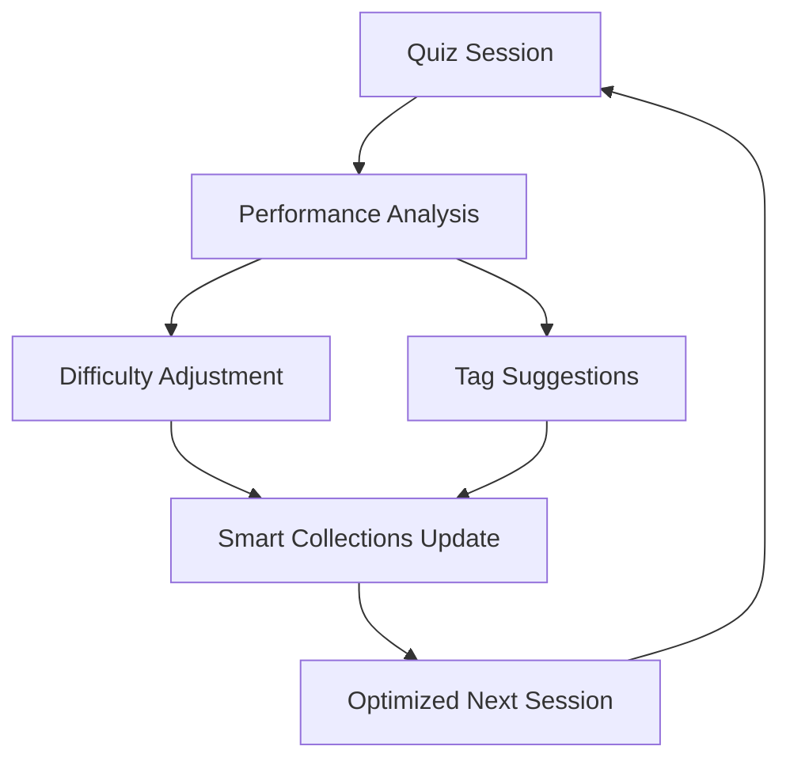

# 🧠 Smart Features

FlashGenie's intelligent features set it apart from traditional flashcard applications. This guide explores the smart systems that adapt to your learning style and optimize your study experience.

## 🎯 **Overview of Smart Features**

FlashGenie includes four core intelligent systems that work together:

1. **[Smart Difficulty Auto-Adjustment](#smart-difficulty-auto-adjustment)** - Cards adapt to your performance
2. **[Hierarchical Tagging System](#hierarchical-tagging)** - Intelligent content organization
3. **[Smart Collections](#smart-collections)** - Dynamic card grouping
4. **[Analytics and Insights](#analytics-and-insights)** - Comprehensive learning analytics

These systems learn from your behavior and continuously optimize your learning experience.

## 🎚️ **Smart Difficulty Auto-Adjustment**

### What is Smart Difficulty?

Smart Difficulty is FlashGenie's most innovative feature. Unlike traditional flashcard apps where difficulty is static, FlashGenie automatically adjusts each card's difficulty based on your performance, creating a personalized learning experience.

### How It Works

The system analyzes multiple factors to determine optimal difficulty:

=== "📊 Performance Factors"

    **Accuracy Rate**
    : How often you answer the card correctly
    
    **Response Time**
    : How quickly you answer (faster = easier for you)
    
    **Confidence Levels**
    : Your self-assessed confidence (1-5 scale)
    
    **Learning Trends**
    : Whether you're improving or struggling over time
    
    **Consistency**
    : How stable your performance is

=== "⚡ Real-Time Adaptation"

    **Immediate Adjustments**
    : Difficulty changes after each review
    
    **Gradual Changes**
    : Maximum 0.2 difficulty change per review
    
    **Explanations**
    : Clear reasons for each adjustment
    
    **History Tracking**
    : Complete record of difficulty changes

### Experiencing Smart Difficulty

During a quiz session, you'll see difficulty adjustments in real-time:

```bash
Question: What is photosynthesis?
Your answer: The process plants use to convert light to energy
✓ Correct!

How confident were you? (1=Very Low, 2=Low, 3=Medium, 4=High, 5=Very High): 4

# FlashGenie provides immediate feedback:
Difficulty adjusted: Difficulty increased slightly based on high accuracy, fast response times
```

### Understanding Difficulty Levels

FlashGenie uses a 0.0 to 1.0 difficulty scale:

| Range | Level | Characteristics | Review Frequency |
|-------|-------|----------------|------------------|
| 0.0-0.3 | **Easy** | High accuracy, fast responses | Longer intervals |
| 0.3-0.7 | **Medium** | Moderate performance | Standard intervals |
| 0.7-1.0 | **Hard** | Lower accuracy, needs practice | Shorter intervals |

### Confidence Ratings

Your confidence ratings (1-5 scale) help FlashGenie understand the difference between lucky guesses and true knowledge:

!!! tip "Using Confidence Ratings Effectively"
    
    - **1 (Very Low)**: Complete guess, no idea
    - **2 (Low)**: Uncertain, might be wrong
    - **3 (Medium)**: Somewhat confident
    - **4 (High)**: Very confident, likely correct
    - **5 (Very High)**: Absolutely certain
    
    **Be honest!** The system learns better from accurate self-assessment.

### Viewing Difficulty Changes

See how your cards have adapted over time:

```bash
python -m flashgenie stats

# Shows recent difficulty adjustments:
Recent Difficulty Adjustments: 12 cards
  What is photosynthesis?... - Difficulty increased based on high accuracy
  What is DNA structure?... - Difficulty decreased based on low accuracy
  What is mitosis?... - Difficulty maintained - performance is stable
```

## 🏷️ **Hierarchical Tagging**

### What is Hierarchical Tagging?

FlashGenie's tagging system goes beyond simple labels. You can create hierarchical tag structures that mirror how knowledge is actually organized.

### Creating Tag Hierarchies

Build logical knowledge structures:

```bash
# Create hierarchical tags
python -m flashgenie tags create "Science > Biology > Cell Structure"
python -m flashgenie tags create "Science > Chemistry > Organic Chemistry"
python -m flashgenie tags create "Languages > Spanish > Grammar > Verbs"
```

This creates a tree structure:
```
Science
├── Biology
│   ├── Cell Structure
│   ├── Genetics
│   └── Ecology
└── Chemistry
    ├── Organic Chemistry
    └── Inorganic Chemistry
```

### Auto-Tagging

FlashGenie can automatically suggest tags based on content analysis:

```bash
# Auto-tag your current deck
python -m flashgenie autotag

# Result:
✓ Added tags to 23 cards

# View suggestions for specific cards
python -m flashgenie tags suggest

# Shows:
Card: What is the quadratic formula?...
Suggested tags: mathematics, algebra, advanced
```

### Built-in Tag Recognition

FlashGenie recognizes common patterns and suggests appropriate tags:

=== "📚 Academic Subjects"

    - **Mathematics**: algebra, geometry, calculus, statistics
    - **Science**: biology, chemistry, physics, astronomy
    - **History**: ancient, medieval, modern, wars
    - **Languages**: grammar, vocabulary, literature

=== "💻 Programming"

    - **Languages**: python, javascript, java, c++
    - **Concepts**: algorithms, data structures, databases
    - **Frameworks**: react, django, flask, spring

=== "📈 Difficulty Levels"

    - **Beginner**: basic, fundamental, introduction
    - **Intermediate**: moderate, standard
    - **Advanced**: complex, difficult, expert

### Tag Management

```bash
# View tag statistics
python -m flashgenie tags

# Create tag aliases
python -m flashgenie tags create "math" --alias-for "mathematics"

# View tag hierarchy
python -m flashgenie tags list --hierarchy
```

## 📦 **Smart Collections**

### What are Smart Collections?

Smart Collections are dynamic groups that automatically organize your flashcards based on various criteria. Unlike static folders, these collections update automatically as your cards change.

### Built-in Collections

FlashGenie creates several collections automatically:

=== "🎯 Difficulty-Based"

    **Easy Cards** (0.0-0.3 difficulty)
    : Cards you've mastered or find straightforward
    
    **Medium Cards** (0.3-0.7 difficulty)
    : Cards at optimal challenge level
    
    **Hard Cards** (0.7-1.0 difficulty)
    : Cards that need more practice

=== "📊 Performance-Based"

    **Struggling Cards**
    : Cards with accuracy below 60%
    
    **Mastered Cards**
    : Cards with accuracy above 90%
    
    **Inconsistent Cards**
    : Cards with variable performance

=== "⏰ Time-Based"

    **Due for Review**
    : Cards scheduled for review today
    
    **Recently Added**
    : Cards added in the last 7 days
    
    **Long Overdue**
    : Cards past their review date

### Exploring Collections

```bash
# View all collections and their statistics
python -m flashgenie collections

# Example output:
Smart Collections
================

Easy Cards
  Description: Cards with difficulty between 0.0 and 0.3
  Cards: 45
  Due: 12
  Avg Difficulty: 0.21
  Avg Accuracy: 89.2%

Struggling Cards
  Description: Cards with accuracy <= 60%
  Cards: 8
  Due: 8
  Avg Difficulty: 0.73
  Avg Accuracy: 45.2%

Due for Review
  Description: Cards that are due for review
  Cards: 23
  Due: 23
```

### Using Collections for Targeted Study

Collections help you focus on specific areas:

```bash
# Study only struggling cards
python -m flashgenie quiz --collection "Struggling Cards"

# Review due cards
python -m flashgenie quiz --collection "Due for Review"

# Practice hard concepts
python -m flashgenie quiz --collection "Hard Cards"
```

### Custom Collections

Create your own collections based on tags:

```bash
# Study only biology cards
python -m flashgenie quiz --tags "biology"

# Focus on advanced mathematics
python -m flashgenie quiz --tags "mathematics,advanced"

# Review Spanish verbs
python -m flashgenie quiz --tags "spanish,verbs"
```

## 📊 **Analytics and Insights**

### Comprehensive Learning Analytics

FlashGenie provides detailed insights into your learning progress:

```bash
python -m flashgenie stats

# Enhanced Statistics: Spanish Vocabulary
# =====================================
# Total Cards: 150        Due for Review: 23
# Reviewed Cards: 89       Average Accuracy: 73.2%
# Total Reviews: 342       Average Difficulty: 0.52
# Avg Response Time: 3.2s
#
# Difficulty Distribution:
# Easy (0.0-0.33): 45 cards
# Medium (0.33-0.67): 78 cards  
# Hard (0.67-1.0): 27 cards
#
# Recent Difficulty Adjustments: 12 cards
#   ¿Cómo estás?... - Difficulty increased based on high accuracy
#   subjunctive mood... - Difficulty decreased based on low accuracy
#
# Top Tags:
#   spanish: 150 cards
#   verbs: 45 cards
#   grammar: 38 cards
#   vocabulary: 67 cards
```

### Understanding Your Metrics

=== "📈 Performance Metrics"

    **Accuracy Rate**
    : Percentage of correct answers
    
    **Response Time**
    : Average time to answer questions
    
    **Review Count**
    : Total number of reviews completed
    
    **Consistency Score**
    : How stable your performance is

=== "🎯 Progress Indicators"

    **Mastery Level**
    : Percentage of cards mastered
    
    **Learning Velocity**
    : Rate of improvement over time
    
    **Difficulty Progression**
    : How card difficulties are changing
    
    **Retention Rate**
    : How well you remember previously learned cards

### Tracking Learning Trends

Monitor your progress over time:

- **Daily Progress**: Cards reviewed, accuracy trends
- **Weekly Patterns**: Best study times, consistency
- **Monthly Overview**: Long-term learning velocity
- **Difficulty Evolution**: How cards adapt to your learning

### Using Analytics for Optimization

!!! tip "Optimize Your Learning"
    
    **High Accuracy (>90%)**
    : You might be ready for more challenging material
    
    **Low Accuracy (<60%)**
    : Focus on struggling cards, consider breaking down complex concepts
    
    **Fast Response Times**
    : Cards may be too easy, difficulty will auto-adjust
    
    **Slow Response Times**
    : Normal for new/difficult material, will improve with practice

## 🔄 **How Smart Features Work Together**

FlashGenie's smart features create a synergistic learning system:



### The Learning Loop

1. **Quiz Session**: You study with adaptive questions
2. **Performance Analysis**: System analyzes your responses
3. **Difficulty Adjustment**: Cards adapt to your performance
4. **Tag Enhancement**: Auto-tagging improves organization
5. **Collection Updates**: Smart collections reflect changes
6. **Optimized Sessions**: Next session is perfectly tailored

### Synergistic Benefits

- **Personalized Difficulty**: Each card finds its optimal challenge level
- **Intelligent Organization**: Tags and collections work together
- **Focused Study**: Collections help you target specific needs
- **Continuous Improvement**: System gets smarter with each session

## 🎯 **Best Practices for Smart Features**

### Maximizing Smart Difficulty

!!! tip "Get the Most from Difficulty Adjustment"
    
    - **Be honest with confidence ratings** - accuracy helps the system learn
    - **Study regularly** - consistent sessions provide better data
    - **Don't worry about perfect scores** - the system optimizes for retention
    - **Trust the process** - difficulty adjustments improve over time

### Effective Tagging Strategies

!!! tip "Organize for Success"
    
    - **Use hierarchical structures** - mirror how knowledge connects
    - **Let auto-tagging help** - review and refine suggestions
    - **Be consistent** - use the same terms across similar cards
    - **Think about study goals** - tag for how you want to review

### Smart Collection Usage

!!! tip "Target Your Study Sessions"
    
    - **Start with due cards** - maintain your spaced repetition schedule
    - **Focus on struggling cards** - address weak areas quickly
    - **Challenge yourself with hard cards** - when you're feeling confident
    - **Review easy cards occasionally** - maintain long-term retention

---

**Ready for advanced techniques?** Continue to [Advanced Usage](advanced-usage.md) to master FlashGenie's power-user features! 🧞‍♂️✨
